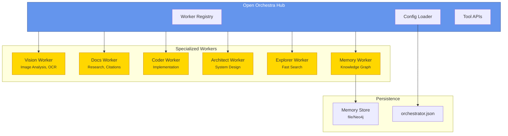
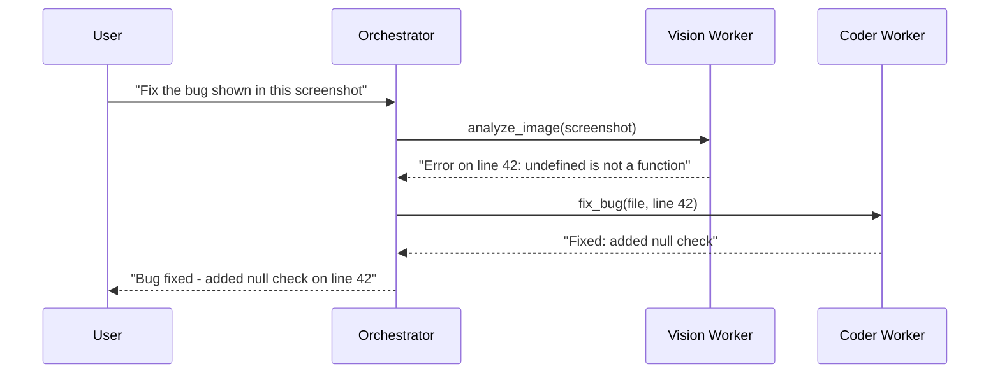
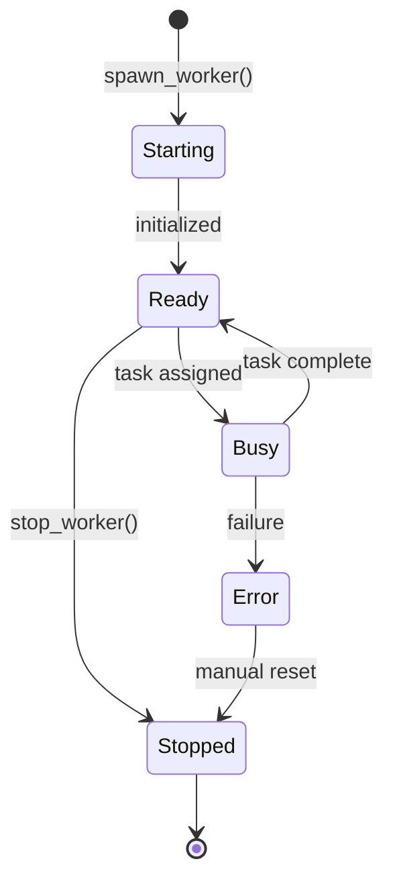

<p align="center">
  <svg xmlns="http://www.w3.org/2000/svg" viewBox="0 0 400 120" width="400" height="120">
    <defs>
      <linearGradient id="grad1" x1="0%" y1="0%" x2="100%" y2="100%">
        <stop offset="0%" style="stop-color:#6495ED;stop-opacity:1" />
        <stop offset="100%" style="stop-color:#4169E1;stop-opacity:1" />
      </linearGradient>
      <linearGradient id="grad2" x1="0%" y1="0%" x2="100%" y2="0%">
        <stop offset="0%" style="stop-color:#FFD700;stop-opacity:1" />
        <stop offset="100%" style="stop-color:#FFA500;stop-opacity:1" />
      </linearGradient>
    </defs>
    <!-- Central Hub -->
    <circle cx="60" cy="60" r="35" fill="url(#grad1)" stroke="#2F4F8F" stroke-width="2"/>
    <text x="60" y="65" text-anchor="middle" fill="white" font-size="12" font-weight="bold" font-family="system-ui">HUB</text>
    <!-- Spokes -->
    <line x1="95" y1="60" x2="130" y2="30" stroke="#4169E1" stroke-width="2" stroke-dasharray="4"/>
    <line x1="95" y1="60" x2="130" y2="60" stroke="#4169E1" stroke-width="2" stroke-dasharray="4"/>
    <line x1="95" y1="60" x2="130" y2="90" stroke="#4169E1" stroke-width="2" stroke-dasharray="4"/>
    <!-- Worker Nodes -->
    <circle cx="145" cy="30" r="15" fill="url(#grad2)" stroke="#CC8400" stroke-width="1.5"/>
    <circle cx="145" cy="60" r="15" fill="url(#grad2)" stroke="#CC8400" stroke-width="1.5"/>
    <circle cx="145" cy="90" r="15" fill="url(#grad2)" stroke="#CC8400" stroke-width="1.5"/>
    <!-- Title -->
    <text x="185" y="50" fill="#333" font-size="28" font-weight="bold" font-family="system-ui">Open</text>
    <text x="260" y="50" fill="#6495ED" font-size="28" font-weight="bold" font-family="system-ui">Orchestra</text>
    <text x="185" y="75" fill="#666" font-size="14" font-family="system-ui">Multi-Agent Orchestration for OpenCode</text>
  </svg>
</p>

<p align="center">
  <a href="https://github.com/open-orchestra/open-orchestra/releases"></a>
  <a href="https://github.com/open-orchestra/open-orchestra/blob/main/LICENSE"></a>
  <a href="https://bun.sh"></a>
  <a href="https://opencode.ai"></a>
</p>

<p align="center">
  <strong>Spawn, manage, and coordinate specialized AI workers in OpenCode</strong>
</p>

---

## Overview

**OpenCode Boomerang** is a multi-agent orchestration system for [OpenCode](https://opencode.ai). This repo ships the **Open Orchestra** plugin (`orchestra/`) plus a control panel UI (`app/`) to spawn, manage, and coordinate specialized AI workers. It implements a **hub-and-spoke architecture** where a central orchestrator coordinates multiple specialized workers, each optimized for specific tasks.

### Why Multiple AI Workers?

Instead of asking one AI to do everything, the Open Orchestra plugin lets you use specialized workers:

| Worker | Best For | Example |
|--------|----------|---------|
| **Vision** | Analyzing screenshots, images, UI mockups | "What error is shown in this screenshot?" |
| **Docs** | Researching APIs, finding examples | "How do I use React's useEffect hook?" |
| **Coder** | Writing and modifying code | "Implement this feature" |
| **Architect** | System design, planning (read-only) | "Review this architecture" |

This specialization means better results, clearer reasoning, and the ability to run tasks in parallel.

## Prerequisites

Before installing the Open Orchestra plugin, verify you have:

| Requirement | Check Command | Expected |
|-------------|---------------|----------|
| Bun runtime | `bun --version` | 1.0.0 or higher |
| OpenCode CLI | `opencode --version` | Any recent version |
| AI Provider | `opencode.json` provider config | At least one model configured |

**Quick verification:**

```bash
bun --version && opencode --version
```

**Need to configure a provider?** Add to `~/.config/opencode/opencode.json`:

```json
{
  "provider": {
    "anthropic": {
      "apiKey": "sk-ant-your-key-here"
    }
  }
}
```

See [docs/getting-started.md](./docs/getting-started.md) for a minimal setup flow and
[docs/configuration.md](./docs/configuration.md) for the full reference.

### Key Features

- **Skill-defined Profiles** - Worker profiles come from `SKILL.md` files (project + global).
- **Control Panel UI** - Sessions, profiles, logs, and SQLite-backed settings in `app/`.
- **Skills + Sessions + DB API** - CRUD + SSE endpoints for skills, session tracking, and preferences.
- **Built-in Workflows** - RooCode Boomerang plus bundled templates with security limits.
- **Vision Auto-Routing** - Inline `[VISION ANALYSIS]` with `.opencode/vision/jobs.jsonl` logs.
- **SQLite Overrides** - Persist user preferences and per-worker model/temperature overrides.
- **Memory System** - File-based memory by default with optional Neo4j backing.

## Architecture

OpenCode Boomerang follows a hub-and-spoke pattern inspired by successful multi-agent systems like AutoGen and LangGraph, but optimized for OpenCode's plugin architecture.



## Quick Start

### Installation

```bash
# Add to your project (pin the version)
bun add @open-orchestra/opencode-orchestrator@0.2.3

# Or install globally
bun add -g @open-orchestra/opencode-orchestrator@0.2.3
```

### Configuration

**1. Create a plugin entry (OpenCode 1.0+):**

```bash
mkdir -p .opencode/plugin
cat > .opencode/plugin/orchestrator.js <<'EOF'
export { OrchestratorPlugin as default } from "@open-orchestra/opencode-orchestrator";
EOF
```

**Alternative (config-based plugins):**

```json
// opencode.json or ~/.config/opencode/opencode.json
{
  "plugin": ["@open-orchestra/opencode-orchestrator"]
}
```

**2. Define skills (profiles):**

Profiles are defined in `.opencode/skill/<id>/SKILL.md` (project) or `~/.opencode/skill/<id>/SKILL.md` (global).
The repo includes sample skills under `orchestra/.opencode/skill` that you can copy into your project.

```bash
mkdir -p .opencode/skill/coder
cat > .opencode/skill/coder/SKILL.md <<'EOF'
---
name: coder
description: Code implementation specialist
model: anthropic/claude-opus-4-5
tools:
  Read: true
  Write: true
  Bash: true
tags:
  - coding
---

You are a code implementation specialist. Focus on clean, testable changes.
EOF
```

**3. Create orchestrator config (optional - auto-setup available):**

```json
// .opencode/orchestrator.json or orchestrator.json
{
  "$schema": "./node_modules/@open-orchestra/opencode-orchestrator/schema/orchestrator.schema.json",
  "autoSpawn": true,
  "workers": ["vision", "docs", "coder"]
}
```

### Control Panel (app/)

The control panel expects OpenCode at `http://localhost:4096` and the Skills/DB API at `http://localhost:4097`.
If you change the skills API port, set `OPENCODE_SKILLS_PORT` for the plugin and `VITE_SKILLS_API_BASE` for the app.

```bash
cd app
bun install
VITE_SKILLS_API_BASE=http://localhost:4097 bun run dev
```

### Desktop App (desktop/)

The desktop shell wraps the control panel UI and can spawn an OpenCode sidecar. To connect to an existing server,
set explicit base URLs.

```bash
cd desktop
bun install
bun run tauri dev
```

**Overrides:**
- `OPENCODE_PORT` / `OPENCODE_SKILLS_PORT`: use existing local ports instead of spawning a sidecar.
- `OPENCODE_DESKTOP_BASE_URL`: full OpenCode server URL (skips sidecar).
- `OPENCODE_DESKTOP_SKILLS_URL`: full Skills/DB API URL.
- `OPENCODE_DESKTOP_PLUGIN_PATH`: absolute path to the orchestrator plugin entry (defaults to auto-detecting `orchestra/dist/index.js` when available).

### Basic Usage



**Spawn workers:**
```bash
spawn_worker({ profileId: "vision" })
spawn_worker({ profileId: "docs" })
```

**Delegate tasks:**
```bash
delegate_task({ task: "Analyze this screenshot", attachments: [...] })
delegate_task({ task: "Find the official React hooks documentation" })
```

**Direct messaging:**
```bash
ask_worker({ workerId: "vision", message: "What's in this image?", attachments: [...] })
```

## Workflows

Workflows run multi-step sequences with security limits:

```bash
list_workflows()
run_workflow({ workflowId: "roocode-boomerang", task: "Implement the new workflow tools" })
```

Built-in workflow IDs:
- `roocode-boomerang`
- `bug-triage`
- `security-audit`
- `qa-regression`
- `spec-to-implementation`
- `data-digest`

Note: these workflows assume matching skill IDs exist (e.g., `reviewer`, `security`, `qa`, `product`, `analyst`).

Slash commands:

- `/orchestrator.status`
- `/orchestrator.spawn <profileId>`
- `/orchestrator.demo`
- `/orchestrator.onboard [--mode council|multimodal|all]`
- `/vision.analyze`
- `/memory.record`
- `/memory.query`

## Onboarding (5-minute guided demo)

Use the control panel route `/onboarding` or run:

```bash
/orchestrator.onboard --mode council
/orchestrator.onboard --mode multimodal
/orchestrator.onboard --mode all
```

Notes:
- Progress is stored in SQLite preferences (`onboarding.step`, `onboarding.completed`, `onboarding.skipped`).
- The multimodal demo uses the `glm47-vision-demo` profile; override or disable it via `orchestrator.json` if needed.

## Profiles (Skills)

Profiles are defined as skills; there are no hardcoded profiles. The orchestrator loads:

- Project skills: `.opencode/skill/<id>/SKILL.md`
- Global skills: `~/.opencode/skill/<id>/SKILL.md` (or `OPENCODE_SKILLS_HOME`)

Sample skill IDs used in this repo's tests/dev assets: `architect`, `coder`, `docs`, `explorer`, `memory`, `vision`.
Use `profiles` in `orchestrator.json` for overrides and the Settings UI for per-user SQLite overrides.

## Worker Lifecycle



## Documentation

### Getting Started
- [Examples](./docs/examples.md) - Real-world use cases and workflows
- [Configuration](./docs/configuration.md) - Orchestrator config and SKILL.md reference
- [Tool Reference](./docs/reference.md) - Tools and slash commands
- [Troubleshooting](./docs/runbooks/troubleshooting.md) - Common issues and fixes

### Reference
- [Primitives](./docs/primitives.md) - File-level map of core services and UI
- [Inventory](./docs/inventory.md) - Module inventory and file map

### Deep Dive
- [Architecture](./docs/architecture.md) - System design and patterns
- [Vision Workflow Report](./docs/vision-workflow-report.md) - Vision routing behavior
- [Runtime Profile](./docs/runtime-profile.md) - Build/test timing report
- [CHANGELOG](./CHANGELOG.md) - Version history and changes

## Tools

| Tool | Description |
|------|-------------|
| `spawn_worker` | Start a worker with a profile |
| `stop_worker` | Stop a running worker |
| `list_workers` | List running workers |
| `list_profiles` | Show available worker profiles |
| `ask_worker` | Send a message to a specific worker |
| `ask_worker_async` | Send a message asynchronously (returns job id) |
| `await_worker_job` | Wait for an async job result |
| `delegate_task` | Auto-route task to the best worker |
| `list_workflows` | List registered workflows |
| `run_workflow` | Run a workflow by id |

### Commands

| Command | Description |
|---------|-------------|
| `orchestrator.status` | Show workers and profiles |
| `orchestrator.spawn` | Spawn a worker by profile id |
| `orchestrator.demo` | Run the demo walkthrough |
| `orchestrator.onboard` | Run the 5-minute onboarding flow |
| `vision.analyze` | Analyze clipboard or file image |
| `memory.record` | Record a memory entry |
| `memory.query` | Query memory entries |

## Advanced: Memory System

OpenCode Boomerang stores memory in a local file by default, with optional Neo4j-backed graph storage if you configure it. See [docs/configuration.md](./docs/configuration.md) for setup instructions.

## Development

```bash
# Install dependencies
bun install

# Orchestra (plugin)
cd orchestra
bun run typecheck
bun test

# Control panel
cd ../app
bun run typecheck
bun run test
```

## Project Structure

```
opencode-boomerang/
├── orchestra/                     # Open Orchestra plugin
│   ├── src/
│   │   ├── api/                   # Skills, sessions, DB routers
│   │   ├── commands/              # Slash command handlers
│   │   ├── communication/         # Event bus + SSE forwarding
│   │   ├── config/                # Config loading + inheritance
│   │   ├── core/                  # Service container + hooks
│   │   ├── db/                    # SQLite persistence
│   │   ├── memory/                # File/Neo4j memory backends
│   │   ├── models/                # Model resolution
│   │   ├── orchestrator/          # Routing + delegation
│   │   ├── permissions/           # Tool permission system
│   │   ├── skills/                # Skill parsing + CRUD
│   │   ├── tools/                 # Tool definitions + guards
│   │   ├── workers/               # Spawn/send/jobs/session manager
│   │   └── workflows/             # Built-in workflows + engine
│   ├── schema/                    # orchestrator.schema.json
│   └── .opencode/                 # Sample skills + agent prompt
├── app/                           # Control panel (Solid.js)
│   ├── src/                       # Pages, components, contexts
│   └── vite.config.ts
├── desktop/                       # Desktop shell (Tauri + app/ UI)
│   ├── src/                        # Tauri frontend wrapper
│   └── src-tauri/                  # Tauri backend
├── docs/                          # Documentation + runbooks
```

## Contributing

Contributions are welcome! Please read our contributing guidelines and submit PRs to the `main` branch.

## License

MIT - see [LICENSE](./LICENSE) for details.

---

<p align="center">
  Built for <a href="https://opencode.ai">OpenCode</a> with orchestration patterns inspired by multi-agent systems research.
</p>
