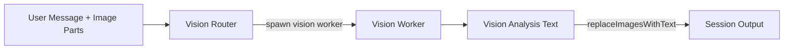

# OpenCode Boomerang Architecture

OpenCode Boomerang is a multi-agent orchestration system built as an OpenCode plugin with a companion control panel UI. It coordinates specialized AI workers through a hub-and-spoke architecture.

## System Overview

```
┌─────────────────────────────────────────────────────────────────────────────┐
│                              OPENCODE BOOMERANG                              │
├─────────────────────────────────────────────────────────────────────────────┤
│                                                                              │
│  ┌──────────────────────────────────────────────────────────────────────┐   │
│  │                        ORCHESTRA (Plugin)                             │   │
│  │                                                                       │   │
│  │   ┌─────────┐  ┌─────────────┐  ┌────────┐  ┌──────────────────┐    │   │
│  │   │   API   │  │Communication│  │ Memory │  │     Workers      │    │   │
│  │   │ Service │  │   Service   │  │ Store  │  │     Manager      │    │   │
│  │   └────┬────┘  └──────┬──────┘  └───┬────┘  └────────┬─────────┘    │   │
│  │        │              │             │                │               │   │
│  │        └──────────────┼─────────────┼────────────────┘               │   │
│  │                       │             │                                 │   │
│  │   ┌─────────────┐     │             │     ┌────────────────────┐     │   │
│  │   │  Workflows  │◄────┼─────────────┼────►│   Orchestrator     │     │   │
│  │   │   Engine    │     │             │     │     Service        │     │   │
│  │   └─────────────┘     │             │     └────────────────────┘     │   │
│  │                       │             │                                 │   │
│  │   ┌───────────────────┴─────────────┴─────────────────────────┐      │   │
│  │   │                      Tools Service                         │      │   │
│  │   │  spawn_worker │ ask_worker │ run_workflow │ list_profiles  │      │   │
│  │   └────────────────────────────────────────────────────────────┘      │   │
│  └──────────────────────────────────────────────────────────────────────┘   │
│                                      │                                       │
│                                      ▼                                       │
│  ┌──────────────────────────────────────────────────────────────────────┐   │
│  │                         APP (Control Panel)                           │   │
│  │                                                                       │   │
│  │   ┌─────────────┐   ┌────────────────┐   ┌─────────────────────┐    │   │
│  │   │   Header    │   │   WorkerList   │   │    WorkerDetail     │    │   │
│  │   │  (Stats)    │   │   (Sidebar)    │   │   (Messages)        │    │   │
│  │   └─────────────┘   └────────────────┘   └─────────────────────┘    │   │
│  │                                                                       │   │
│  │   ┌─────────────────────────┐   ┌────────────────────────────────┐  │   │
│  │   │       JobQueue          │   │         LogStream              │  │   │
│  │   │    (Activity Panel)     │   │    (Events + Terminal)         │  │   │
│  │   └─────────────────────────┘   └────────────────────────────────┘  │   │
│  └──────────────────────────────────────────────────────────────────────┘   │
│                                                                              │
└─────────────────────────────────────────────────────────────────────────────┘
```

The plugin also runs a local Skills API server (default `http://127.0.0.1:4097`) that serves skills CRUD, session telemetry, and SQLite preference endpoints for the control panel UI.

## Monorepo Structure

```
opencode-boomerang/
├── orchestra/                    # Backend plugin (Node.js/Bun)
│   ├── src/
│   │   ├── index.ts             # Plugin entry point
│   │   ├── api/                 # Skills, sessions, DB routers
│   │   ├── commands/            # Slash command handlers
│   │   ├── communication/       # Event system (EventEmitter + SSE)
│   │   ├── config/              # Config loading and parsing
│   │   ├── core/                # Service container and lifecycle
│   │   ├── db/                  # SQLite persistence
│   │   ├── helpers/             # Utilities
│   │   ├── integrations/        # External integrations (Linear, Neo4j)
│   │   ├── memory/              # Knowledge graph and persistence
│   │   ├── models/              # Model resolution and hydration
│   │   ├── orchestrator/        # Task delegation and routing
│   │   ├── permissions/         # Tool permission system
│   │   ├── profiles/            # Worker profile discovery
│   │   ├── skills/              # SKILL.md parsing + CRUD
│   │   ├── tools/               # OpenCode tool definitions
│   │   ├── types/               # TypeScript interfaces
│   │   ├── ux/                  # UX helpers
│   │   ├── workers/             # Worker management system
│   │   └── workflows/           # Workflow engine
│   ├── schema/                  # JSON schemas
│   ├── .opencode/               # Sample skills + agent prompt
│   └── test/                    # E2E and integration tests
│
└── app/                         # Frontend control panel (Solid.js)
    ├── src/
    │   ├── app.tsx              # Root component
    │   ├── entry.tsx            # DOM mount point
    │   ├── components/          # UI components
    │   ├── context/             # State providers
    │   ├── pages/               # Page components
    │   └── lib/                 # Utilities
    └── vite.config.ts           # Build configuration
```

## Core Service Architecture

```
                    ┌─────────────────────────────────────┐
                    │           OrchestratorPlugin        │
                    │                                     │
                    │   loadOrchestratorConfig()          │
                    │              │                      │
                    │              ▼                      │
                    │      createCore(config)             │
                    └──────────────┬──────────────────────┘
                                   │
           ┌───────────────────────┼───────────────────────┐
           │                       │                       │
           ▼                       ▼                       ▼
    ┌─────────────┐        ┌─────────────┐         ┌─────────────┐
    │  createApi  │        │  createComm │         │ createMemory│
    │             │        │             │         │    Store    │
    └──────┬──────┘        └──────┬──────┘         └──────┬──────┘
           │                      │                       │
           ├──────────────────────┼───────────────────────┤
           │                      │                       │
           ▼                      ▼                       ▼
    ┌──────────────────────────────────────────────────────────┐
    │                  createWorkerManager                      │
    │                                                           │
    │  ┌─────────────┐  ┌─────────────┐  ┌─────────────────┐  │
    │  │  Registry   │  │ JobRegistry │  │  spawn/send/    │  │
    │  │  (Map)      │  │  (Jobs)     │  │  stop methods   │  │
    │  └─────────────┘  └─────────────┘  └─────────────────┘  │
    └───────────────────────────┬──────────────────────────────┘
                                │
           ┌────────────────────┼────────────────────┐
           │                    │                    │
           ▼                    ▼                    ▼
    ┌─────────────┐      ┌─────────────┐     ┌─────────────┐
    │  createWork │      │ createOrch  │     │ createTools │
    │  flowEngine │      │  estrator   │     │             │
    └─────────────┘      └─────────────┘     └─────────────┘
```

Additional services created in `createCore`:
- `createDatabase` (SQLite user prefs + overrides)
- `createSkillsService` + `createSkillsApiServer` (skills CRUD + sessions/db APIs)
- `commands` (slash command execution)

### Service Dependencies

| Service | Depends On | Purpose |
|---------|------------|---------|
| `api` | OpenCode SDK | SDK client wrapper for sessions, files, events |
| `communication` | api | Event emission and SSE streaming |
| `database` | (none) | SQLite persistence for preferences and worker overrides |
| `memory` | api | Knowledge graph storage and injection |
| `workers` | api, communication, memory | Worker spawn, send, lifecycle |
| `workflows` | (none) | Multi-step workflow execution |
| `orchestrator` | api, workers, workflows, communication | Task delegation and routing |
| `tools` | orchestrator, workers, workflows | Plugin tool definitions |
| `skills` | projectDir | Skill parsing, CRUD, and events |
| `skillsApi` | skills, workers, db | HTTP API for skills, sessions, and DB |
| `commands` | api, orchestrator, workers, memory | Slash command handling |

### Factory Pattern

All services follow the standard factory pattern:

```typescript
type Factory<TConfig, TDeps, TService> = (input: {
  config: TConfig;
  deps: TDeps;
}) => TService;

interface ServiceLifecycle {
  start(): Promise<void>;
  stop(): Promise<void>;
  health(): Promise<{ ok: boolean; info?: any }>;
}
```

## Worker System

### Worker Lifecycle State Machine

```
                    ┌──────────────┐
                    │              │
          ┌─────────►   starting   │
          │         │              │
          │         └───────┬──────┘
          │                 │
    spawn │                 │ ready
          │                 ▼
          │         ┌──────────────┐
          │         │              │◄────────────┐
          │         │    ready     │             │
          │         │              │─────────────┤
          │         └───────┬──────┘             │
          │                 │                    │
          │            send │                    │ response
          │                 ▼                    │
          │         ┌──────────────┐             │
          │         │              │             │
          │         │     busy     │─────────────┘
          │         │              │
          │         └───────┬──────┘
          │                 │
          │                 │ error/stop
          │                 ▼
          │         ┌──────────────┐
          │         │              │
          └─────────│    stopped   │
                    │              │
                    └──────────────┘
```

### Worker Profile Structure

```typescript
interface WorkerProfile {
  id: string;              // Unique identifier
  name: string;            // Human-readable name
  model: string;           // Model spec (provider/model or auto tag)
  providerID?: string;     // Optional provider override
  purpose: string;         // What this worker does
  whenToUse: string;       // Context for selection
  systemPrompt?: string;   // Optional override
  supportsVision?: boolean;
  supportsWeb?: boolean;
  tools?: Record<string, boolean>;
  permissions?: ToolPermissions;
  temperature?: number;
  maxTokens?: number;
  injectRepoContext?: boolean;
  enabled?: boolean;
  tags?: string[];
  extends?: string;        // Inherit from another profile
  compose?: string[];      // Combine multiple profiles
  sessionMode?: "child" | "isolated" | "linked";
  forwardEvents?: Array<"tool" | "message" | "error" | "complete" | "progress">;
  mcp?: { servers?: string[]; inheritAll?: boolean };
  env?: Record<string, string>;
  envPrefixes?: string[];
}
```

### Skill-defined Profiles

Profiles are loaded from SKILL.md files (project or global); there are no hardcoded profiles.
The repo ships sample skills under `orchestra/.opencode/skill` for tests and local dev.

Built-in workflows assume specific profile IDs exist (e.g., `reviewer`, `security`, `qa`, `product`, `analyst`).

### Worker Spawn Flow

```
                    User/Tool Request
                           │
                           ▼
                 ┌─────────────────────┐
                 │   spawnById(id)     │
                 └──────────┬──────────┘
                            │
                            ▼
                 ┌─────────────────────┐
                 │  Resolve Model      │
                 │  (hydrate.ts)       │
                 └──────────┬──────────┘
                            │
                            ▼
                 ┌─────────────────────┐
                 │  Create OpenCode    │
                 │  Config (merged)    │
                 └──────────┬──────────┘
                            │
                            ▼
                 ┌─────────────────────┐
                 │ api.createServer()  │
                 │ (in-process)        │
                 └──────────┬──────────┘
                            │
                            ▼
                 ┌─────────────────────┐
                 │ Create Session in   │
                 │ Worker OpenCode     │
                 └──────────┬──────────┘
                            │
                            ▼
                 ┌─────────────────────┐
                 │ Wait for Ready      │
                 │ (timeout: 30s)      │
                 └──────────┬──────────┘
                            │
                            ▼
                 ┌─────────────────────┐
                 │ Register in         │
                 │ WorkerRegistry      │
                 └──────────┬──────────┘
                            │
                            ▼
                 ┌─────────────────────┐
                 │ Emit worker.ready   │
                 │ Event               │
                 └─────────────────────┘
```

## Communication Layer

### Event Flow

```
┌─────────────────────────────────────────────────────────────────────────┐
│                         Communication Service                            │
├─────────────────────────────────────────────────────────────────────────┤
│                                                                          │
│   ┌─────────────────┐       ┌─────────────────┐                         │
│   │  EventEmitter   │◄──────│  Services emit  │                         │
│   │  (Node.js)      │       │  events here    │                         │
│   └────────┬────────┘       └─────────────────┘                         │
│            │                                                             │
│            │  on(type, handler)                                          │
│            │                                                             │
│            ▼                                                             │
│   ┌─────────────────┐       ┌─────────────────┐                         │
│   │  Internal       │──────►│  Forward to     │                         │
│   │  Subscribers    │       │  SSE via TUI    │                         │
│   └─────────────────┘       └────────┬────────┘                         │
│                                      │                                   │
│                                      ▼                                   │
│                             ┌─────────────────┐                         │
│                             │ api.tui.publish │──────► Frontend         │
│                             └─────────────────┘                         │
│                                                                          │
│   ┌─────────────────────────────────────────────────────────────────┐   │
│   │                   Event Types (OrchestraEventName)               │   │
│   ├──────────────────────────┬──────────────────────────────────────┤   │
│   │  orchestra.started       │  Orchestrator lifecycle               │   │
│   │  orchestra.model.*       │  Model resolution events              │   │
│   │  orchestra.worker.*      │  Worker lifecycle/job/stream/response │   │
│   │  orchestra.session.*     │  Session telemetry events             │   │
│   │  skill.*                 │  Skill CRUD events                    │   │
│   │  orchestra.server.event  │  OpenCode SDK events                  │   │
│   └──────────────────────────┴──────────────────────────────────────┘   │
└─────────────────────────────────────────────────────────────────────────┘
```

## API Service

### SDK Client Wrapper

```
┌──────────────────────────────────────────────────────────────────────────┐
│                              API Service                                  │
├──────────────────────────────────────────────────────────────────────────┤
│                                                                           │
│   ┌────────────────────┐                                                 │
│   │   createOpencode   │──────► createServer (for workers)               │
│   │   Client (SDK)     │                                                 │
│   └─────────┬──────────┘                                                 │
│             │                                                            │
│             │  withDirectory(directory, args)                            │
│             │  (auto-adds query.directory)                               │
│             ▼                                                            │
│   ┌─────────────────────────────────────────────────────────────────┐   │
│   │                     API Methods                                  │   │
│   ├─────────────────────────────────────────────────────────────────┤   │
│   │                                                                  │   │
│   │   session.create │ list │ get │ prompt │ messages │ abort       │   │
│   │                                                                  │   │
│   │   event.subscribe (SSE stream)                                   │   │
│   │                                                                  │   │
│   │   file.read                                                      │   │
│   │                                                                  │   │
│   │   find.text │ files                                              │   │
│   │                                                                  │   │
│   │   project.list │ current                                         │   │
│   │                                                                  │   │
│   │   config.get │ providers                                         │   │
│   │                                                                  │   │
│   │   tui.appendPrompt │ showToast │ submitPrompt │ publish          │   │
│   │                                                                  │   │
│   └─────────────────────────────────────────────────────────────────┘   │
└──────────────────────────────────────────────────────────────────────────┘
```

## Tool System

### Available Tools

```
┌──────────────────────────────────────────────────────────────────────────┐
│                           Tools Service                                   │
├──────────────────────────────────────────────────────────────────────────┤
│                                                                           │
│   ┌─────────────────────────────────────────────────────────────────┐   │
│   │                      Worker Tools                                │   │
│   ├──────────────────┬──────────────────────────────────────────────┤   │
│   │  spawn_worker    │  Spawn worker by profile ID                  │   │
│   │  stop_worker     │  Stop running worker                         │   │
│   │  list_workers    │  List all running workers                    │   │
│   │  list_profiles   │  List available profiles                     │   │
│   │  ask_worker      │  Send message, wait for response             │   │
│   │  ask_worker_async│  Send message, return job ID                 │   │
│   │  await_worker_job│  Wait for async job result                   │   │
│   │  delegate_task   │  Route task to best worker                   │   │
│   └──────────────────┴──────────────────────────────────────────────┘   │
│                                                                           │
│   ┌─────────────────────────────────────────────────────────────────┐   │
│   │                     Workflow Tools                               │   │
│   ├──────────────────┬──────────────────────────────────────────────┤   │
│   │  run_workflow    │  Execute multi-step workflow                 │   │
│   │  list_workflows  │  List available workflows                    │   │
│   └──────────────────┴──────────────────────────────────────────────┘   │
│                                                                           │
│   ┌─────────────────────────────────────────────────────────────────┐   │
│   │                        Hooks                                     │   │
│   ├──────────────────┬──────────────────────────────────────────────┤   │
│   │  tool.execute.before               │  Guard/validate tools       │   │
│   │  tui.command.execute               │  Handle slash commands      │   │
│   │  chat.message                      │  Vision routing hook        │   │
│   │  experimental.chat.system.transform│  Inject system context      │   │
│   │  experimental.chat.messages.transform│ Sync vision markers       │   │
│   │  experimental.session.compacting   │  Session compaction         │   │
│   └──────────────────┴──────────────────────────────────────────────┘   │
└──────────────────────────────────────────────────────────────────────────┘
```

## Workflow Engine

### Workflow Execution Flow

```
              run_workflow(workflowId, task)
                         │
                         ▼
              ┌─────────────────────┐
              │ Validate Input Size │
              │ (maxTaskChars)      │
              └──────────┬──────────┘
                         │
                         ▼
              ┌─────────────────────┐
              │ Get Workflow        │
              │ Definition          │
              └──────────┬──────────┘
                         │
                         ▼
         ┌───────────────────────────────────┐
         │         FOR EACH STEP             │
         │  ┌─────────────────────────────┐  │
         │  │ Resolve Worker (autoSpawn)  │  │
         │  └──────────────┬──────────────┘  │
         │                 │                 │
         │                 ▼                 │
         │  ┌─────────────────────────────┐  │
         │  │ Build Prompt from Template  │  │
         │  │  {task} + {carry}           │  │
         │  └──────────────┬──────────────┘  │
         │                 │                 │
         │                 ▼                 │
         │  ┌─────────────────────────────┐  │
         │  │ Send to Worker              │  │
         │  │ (with timeout)              │  │
         │  └──────────────┬──────────────┘  │
         │                 │                 │
         │                 ▼                 │
         │  ┌─────────────────────────────┐  │
         │  │ Record Step Result          │  │
         │  │ (success/error)             │  │
         │  └──────────────┬──────────────┘  │
         │                 │                 │
         │                 ▼                 │
         │  ┌─────────────────────────────┐  │
         │  │ If step.carry:              │  │
         │  │   Append to carry context   │  │
         │  └──────────────┬──────────────┘  │
         │                 │                 │
         │                 │ (loop)          │
         └─────────────────┼─────────────────┘
                           │
                           ▼
              ┌─────────────────────┐
              │ Return Workflow     │
              │ Run Result          │
              └─────────────────────┘
```

### Workflow Definition

```typescript
interface WorkflowDefinition {
  id: string;
  name: string;
  description: string;
  steps: WorkflowStepDefinition[];
}

interface WorkflowStepDefinition {
  id: string;
  title: string;
  workerId: string;
  prompt: string;      // Template with {task} and {carry}
  carry?: boolean;     // Pass output to next step
}
```

## Memory System

### Memory Architecture

```
┌──────────────────────────────────────────────────────────────────────────┐
│                           Memory Service                                  │
├──────────────────────────────────────────────────────────────────────────┤
│                                                                           │
│   ┌─────────────────────────────────────────────────────────────────┐   │
│   │                    Configuration                                 │   │
│   ├───────────────┬─────────────────────────────────────────────────┤   │
│   │  enabled      │  Enable/disable memory system                   │   │
│   │  autoInject   │  Auto-inject context into worker prompts        │   │
│   │  autoRecord   │  Auto-record conversations                      │   │
│   │  scope        │  "project" | "global"                           │   │
│   └───────────────┴─────────────────────────────────────────────────┘   │
│                                                                           │
│   ┌─────────────────────────────────────────────────────────────────┐   │
│   │                      Operations                                  │   │
│   ├──────────────────┬──────────────────────────────────────────────┤   │
│   │  inject()        │  Build and inject memory context             │   │
│   │  record()        │  Store message in memory graph               │   │
│   │  search()        │  Query memory for relevant context           │   │
│   │  trim()          │  Prune old/irrelevant entries                │   │
│   └──────────────────┴──────────────────────────────────────────────┘   │
│                                                                           │
│   ┌─────────────────────────────────────────────────────────────────┐   │
│   │                       Backends                                   │   │
│   ├──────────────────┬──────────────────────────────────────────────┤   │
│   │  File Store      │  Default: JSON files in .opencode/memory     │   │
│   │  Neo4j           │  Optional: Graph database for persistence    │   │
│   └──────────────────┴──────────────────────────────────────────────┘   │
│                                                                           │
└──────────────────────────────────────────────────────────────────────────┘
```

## Frontend Architecture

### Component Hierarchy

```
App (app.tsx)
│
└── OpenCodeProvider (context/opencode.tsx)
    │
    └── SkillsProvider (context/skills.tsx)
        │
        └── DbProvider (context/db.tsx)
            │
            └── LayoutProvider (context/layout.tsx)
                │
                └── AppLayout (components/layout/app-layout.tsx)
                    │
                    ├── ChatPage (pages/chat.tsx)
                    │   ├── SessionList (components/sidebar/worker-list.tsx)
                    │   └── ChatView (components/worker-detail.tsx)
                    │
                    ├── AgentsPage (pages/agents.tsx)
                    │
                    ├── ProfilesPage (pages/profiles.tsx)
                    │   ├── SkillList (components/skills/skill-list.tsx)
                    │   └── SkillsWorkspace (components/skills/skills-workspace.tsx)
                    │
                    ├── LogsPage (pages/logs.tsx)
                    │   └── LogsPanel (components/log-stream.tsx)
                    │
                    └── SettingsPage (pages/settings.tsx)
```

### State Management

```
┌──────────────────────────────────────────────────────────────────────────┐
│                         OpenCode Context                                  │
├──────────────────────────────────────────────────────────────────────────┤
│                                                                           │
│   State (createStore)                                                     │
│   ├── connected: boolean                                                  │
│   ├── version: string | null                                              │
│   ├── sessions: Record<string, Session>                                   │
│   ├── messages: Record<string, Message[]>  // sessionId -> messages       │
│   ├── parts: Record<string, Part[]>        // messageId -> parts          │
│   ├── agents: Agent[]                                                     │
│   └── lastUpdate: number                                                  │
│                                                                           │
│   Actions                                                                 │
│   ├── refresh()           // Fetch sessions + agents                      │
│   ├── fetchMessages(id)   // Get session messages                         │
│   ├── createSession()     // Start new session                            │
│   ├── deleteSession(id)   // Remove session                               │
│   ├── sendMessage(id, content) // Send to session                         │
│   └── abortSession(id)    // Cancel session                               │
│                                                                           │
└──────────────────────────────────────────────────────────────────────────┘

┌──────────────────────────────────────────────────────────────────────────┐
│                          Layout Context                                   │
├──────────────────────────────────────────────────────────────────────────┤
│                                                                           │
│   State                                                                   │
│   ├── sidebarOpen: boolean                                                │
│   ├── selectedWorkerId: string | null                                     │
│   ├── showJobQueue: boolean                                               │
│   ├── showLogs: boolean                                                   │
│   └── commandPaletteOpen: boolean                                         │
│                                                                           │
│   Computed                                                                │
│   ├── isMobile(): boolean       // < 640px                                │
│   ├── isTablet(): boolean       // 640-1024px                             │
│   └── isDesktop(): boolean      // > 1024px                               │
│                                                                           │
│   Keyboard Shortcuts                                                      │
│   ├── Cmd+K   -> toggle command palette                                   │
│   ├── Cmd+B   -> toggle sidebar                                           │
│   └── Escape  -> close modals                                             │
│                                                                           │
└──────────────────────────────────────────────────────────────────────────┘

┌──────────────────────────────────────────────────────────────────────────┐
│                         Skills Context                                    │
├──────────────────────────────────────────────────────────────────────────┤
│                                                                           │
│   State                                                                   │
│   ├── skills: Skill[]                                                     │
│   ├── selectedSkillId: string | null                                      │
│   └── createDialogOpen: boolean                                           │
│                                                                           │
│   Actions                                                                 │
│   ├── refresh()                                                           │
│   ├── createSkill()                                                       │
│   ├── updateSkill()                                                       │
│   ├── deleteSkill()                                                       │
│   └── duplicateSkill()                                                    │
│                                                                           │
└──────────────────────────────────────────────────────────────────────────┘

┌──────────────────────────────────────────────────────────────────────────┐
│                           DB Context                                      │
├──────────────────────────────────────────────────────────────────────────┤
│                                                                           │
│   State                                                                   │
│   ├── dbPath: string                                                      │
│   ├── user: DbUser | null                                                 │
│   ├── preferences: Record<string, string | null>                          │
│   └── workerConfigs: WorkerConfig[]                                       │
│                                                                           │
│   Actions                                                                 │
│   ├── setPreference() / deletePreference()                                │
│   ├── setWorkerConfig() / clearWorkerConfig()                             │
│   └── markOnboarded()                                                     │
│                                                                           │
└──────────────────────────────────────────────────────────────────────────┘
```

### Data Flow: Session Selection

```
User clicks session in WorkerList
              │
              ▼
┌─────────────────────────────────────┐
│ LayoutContext.selectWorker(id)      │
│ -> setSelectedWorkerId(id)          │
└──────────────────┬──────────────────┘
                   │
                   ▼
┌─────────────────────────────────────┐
│ WorkerDetail component reacts       │
│ -> reads selectedWorkerId()         │
└──────────────────┬──────────────────┘
                   │
                   ▼
┌─────────────────────────────────────┐
│ createEffect triggers               │
│ -> opencode.fetchMessages(id)       │
└──────────────────┬──────────────────┘
                   │
                   ▼
┌─────────────────────────────────────┐
│ API call: client.session.messages() │
└──────────────────┬──────────────────┘
                   │
                   ▼
┌─────────────────────────────────────┐
│ State update: messages[id] = [...]  │
└──────────────────┬──────────────────┘
                   │
                   ▼
┌─────────────────────────────────────┐
│ UI re-renders with messages         │
└─────────────────────────────────────┘
```

## Job Queue System

### Job Lifecycle

```typescript
interface WorkerJob {
  id: string;                    // UUID
  workerId: string;              // Worker that runs this job
  message: string;               // Task message
  sessionId?: string;            // OpenCode session
  requestedBy?: string;          // Agent that requested
  status: "running" | "succeeded" | "failed" | "canceled";
  startedAt: number;
  finishedAt?: number;
  durationMs?: number;
  responseText?: string;
  error?: string;
  report?: {
    summary?: string;
    details?: string;
    issues?: string[];
    notes?: string;
  };
}
```

### Job Flow

```
ask_worker_async(workerId, message)
              │
              ▼
┌─────────────────────────────────────┐
│ jobs.create()                       │
│ -> status: "running"                │
│ -> returns job ID immediately       │
└──────────────────┬──────────────────┘
                   │
     ┌─────────────┴─────────────┐
     │                           │
     ▼                           ▼
┌──────────────┐          ┌──────────────┐
│ Return jobId │          │ Background   │
│ to caller    │          │ execution    │
└──────────────┘          └───────┬──────┘
                                  │
                                  ▼
                   ┌─────────────────────────────┐
                   │ workers.send(workerId, msg) │
                   └──────────────┬──────────────┘
                                  │
              ┌───────────────────┴───────────────────┐
              │                                       │
              ▼                                       ▼
    ┌─────────────────┐                    ┌─────────────────┐
    │    Success      │                    │    Error        │
    │                 │                    │                 │
    │ jobs.setResult  │                    │ jobs.setResult  │
    │ (responseText)  │                    │ (error)         │
    └─────────────────┘                    └─────────────────┘
```

## Configuration System

### Config Resolution Order

```
┌─────────────────────────────────────────────────────────────────────────┐
│                    Configuration Priority                                │
├─────────────────────────────────────────────────────────────────────────┤
│                                                                          │
│   1. Default Config (src/config/orchestrator/defaults.ts)               │
│          │                                                               │
│          ▼ (merged with)                                                 │
│   2. Global Config (~/.opencode/orchestrator.json)                       │
│          │                                                               │
│          ▼ (merged with)                                                 │
│   3. Project Config (.opencode/orchestrator.json or orchestrator.json)   │
│          │                                                               │
│          ▼                                                               │
│   4. Runtime Env Overrides (integrations, skills API, vision prompt)     │
│                                                                          │
└─────────────────────────────────────────────────────────────────────────┘
```

## Error Handling and Timeouts

| Operation | Default Timeout | Max Timeout |
|-----------|-----------------|-------------|
| Worker spawn | 30s | configurable |
| Worker send | 600s (10min) | configurable |
| Ready wait | 5min | capped by send timeout |
| Workflow step | 120s (2min) | configurable (security limit) |

### Resilience Patterns

- **Job Retention**: 24h or max 200 jobs
- **Event Subscription**: Non-fatal failures (logged)
- **Memory Injection**: Non-blocking, catches errors
- **Config Parse**: Falls back to defaults if files missing

## Skills System

Worker profiles are defined as skills following the Agent Skills Standard with OpenCode extensions:

```
.opencode/skill/<id>/SKILL.md     # Project-specific
~/.opencode/skill/<id>/SKILL.md   # User's global (or OPENCODE_SKILLS_HOME)
```

The skills API (`/api/skills`) exposes CRUD + SSE for the control panel, and profiles are reloaded on skill changes.

## Vision Routing Flow (Mermaid)


